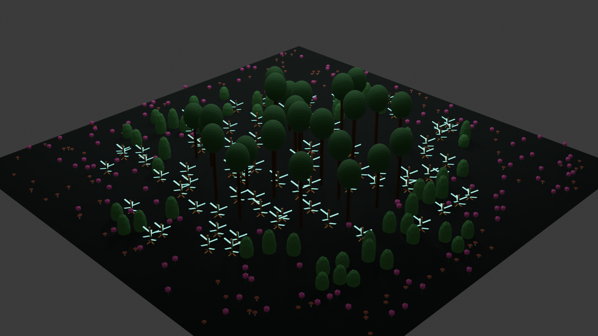

# Lab 05 – Proceduralny Generator Lasu z Typami Roślin i Biomami

*Rys. 1. Finałowy render lasu proceduralnego z widocznym podziałem na biomy i efektami neonowymi (Bloom).*

## Co zostało zrealizowane
W ramach laboratorium zaimplementowałem zaawansowany, w pełni proceduralny generator lasu, wykorzystujący architekturę obiektową w środowisku Blender Python (bpy). Projekt realizuje wszystkie wytyczne instrukcji oraz zawiera liczne elementy dodatkowe.

### Kluczowe funkcjonalności:
* **[Zadanie 4.1] Konfiguracja oparta na danych:** Parametry wszystkich gatunków (zakresy wysokości, kolory, promienie) zostały zdefiniowane w strukturze `SPECIES_BOOK` przy użyciu klas danych (`SpeciesConfig`). Pozwala to na łatwą modyfikację ekosystemu bez ingerencji w kod logiczny.
* **[Zadanie 4.2] Fabryka Geometrii:** Klasa `GeometryFactory` odpowiada za budowanie modeli (drzewa, krzewy, kwiaty). Każdy obiekt jest dynamicznie generowany na podstawie przekazanych parametrów konfiguracyjnych.
* **[Zadanie 4.3] Zaawansowany System Biomów:** Zaimplementowałem radialną logikę rozkładu roślinności. Na podstawie znormalizowanego dystansu od środka pola, skrypt przypisuje rośliny do odpowiednich stref:
    * **Centrum (0-50%):** Dominacja dużych drzew (`DEB`) oraz form biomechanicznych (`BIOMECH`).
    * **Półperyferia (50-85%):** Krzewy, kwiaty oraz rzadsze formy biomechaniczne.
    * **Peryferia (>85%):** Krawędź lasu zdominowana przez kwiaty i grzyby.
* **[Zadanie 4.4] Zarządzanie Zasobami i Kolekcje:** System automatycznie czyści scenę przed każdą generacją i linkuje nowo powstałe obiekty do nazwanej kolekcji `Las_System`, co pozwala na zachowanie porządku w Outlinerze.

### Zadania Dodatkowe:
* **[Zadanie Dodatkowe - Grzyb]:** Wprowadzono czwarty typ rośliny (`GRZYB`) z dedykowaną geometrią (trzon i kapelusz), przypisany do strefy krawędziowej.
* **[Zadanie Dodatkowe - Skalowanie]:** Wprowadziłem dynamiczny mnożnik skali (`scale_multiplier`), który sprawia, że rośliny naturalnie maleją wraz z oddalaniem się od centrum biomu, co nadaje kompozycji głębi i realizmu.

## Uruchomienie
1.  Otwórz program **Blender** (zalecana wersja 3.0 lub nowsza).
2.  Przejdź do zakładki **Scripting**.
3.  Otwórz plik `las05.py` i naciśnij przycisk **Run Script**.
4.  Skrypt automatycznie:
    * Wyczyści scenę (obiekty i materiały).
    * Wygeneruje ok. 400 obiektów z aktywnym systemem sprawdzania kolizji.
    * Ustawi kamerę w widoku produktowym i doda oświetlenie typu Area/Sun.
    * Skonfiguruje silnik renderujący **Eevee** z włączonym efektem Bloom i odbiciami w podłożu.

## Trudności / refleksja
Największym wyzwaniem było zoptymalizowanie pętli sprawdzającej kolizje przy dużej liczbie obiektów (target_count=400). Zastosowanie mnożnika promienia kolizji pozwoliło na uzyskanie gęstego, ale estetycznego lasu bez efektu przenikania się geometrii. Ciekawym odkryciem była stabilność działania klasy `ResourceManager` przy wielokrotnym usuwaniu i tworzeniu materiałów o tych samych nazwach.