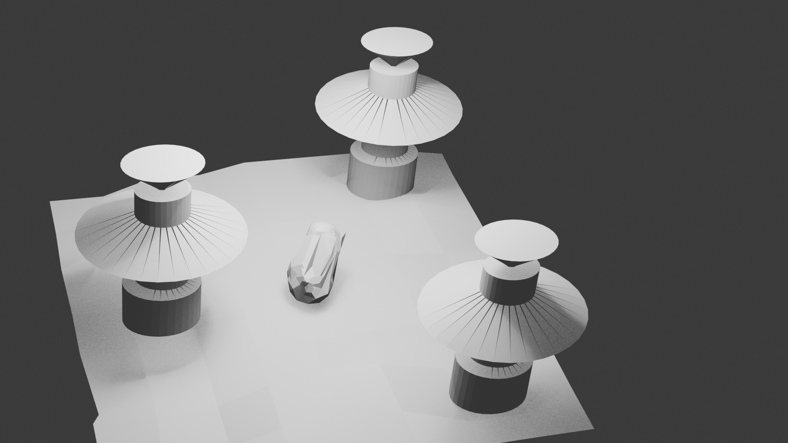

# Lab 07 – Biomechaniczny Teren: Wejście do Podziemnego Lasu

## Podgląd Sceny

## Co zostało zrealizowane
W ramach zadania zbudowałem trójwymiarową scenę przedstawiającą geometryczną interpretację "wejścia do podziemnego lasu". Projekt został wykonany w całości ręcznie w programie Blender, wykorzystując techniki modelowania siatki (mesh modeling).

### Kluczowe elementy projektu:
* **Podłoże (`Teren_Podloze`):** Płaszczyzna (Plane) przeskalowana do wymiarów 10×10. Wykorzystałem tryb **Edit Mode**, aby ręcznie przesunąć wierzchołki na osi Z, tworząc nieregularne, schodkowe ukształtowanie terenu widoczne w lewym dolnym rogu.
* **Filary Biomechaniczne (`Filar_A`, `Filar_B`, `Filar_C`):** Trzy symetrycznie rozmieszczone obiekty bazujące na cylindrach. Górna część każdego filaru została zmodyfikowana wielokrotnymi operacjami **Extrude (E)** oraz **Scale (S)**, tworząc talerzowate, organiczno-techniczne formy zakończone zwężającym się elementem.
* **Centralny Element (`Rdzen_Centralny`):** Obiekt umieszczony w centrum kompozycji, stworzony z prymitywu poddanego co najmniej 5 operacjom edycyjnym (Extrude, Loop Cut), co nadało mu unikalny, "skalisty" kształt serca instalacji.
* **Kompozycja i Kamera:** Scena została zaplanowana w układzie trójkątnym, co nadaje jej stabilność i rytm. Kamera została ustawiona pod kątem, który podkreśla monumentalność filarów względem terenu.

### Wymagania techniczne:
* **Min. 3 obiekty w Edit Mode:** Tak (podłoże, filary, rdzeń).
* **Użycie Extrude (min. 5 razy):** Tak, głównie przy formowaniu głowic filarów.
* **Użycie Loop Cut (min. 3 razy):** Tak, zastosowane do dodania detali na trzonach kolumn.
* **Nazewnictwo:** Wszystkie obiekty posiadają czytelne nazwy w Outlinerze.

## Uruchomienie
1.  Otwórz plik `teren_06.blend` w programie Blender (wersja 3.0 lub nowsza).
2.  Aby zobaczyć widok identyczny z załączonym renderem, naciśnij `Numpad 0`.
3.  Projekt jest gotowy do podglądu w trybach **Solid** lub **Material Preview**.

## Trudności / refleksja
Największym wyzwaniem było zachowanie balansu między prostotą prymitywów a uzyskaniem efektu "biomechaniczności". Odkryłem, że proste operacje skalowania wytłoczonych ścian (Extrude + Scale) pozwalają w bardzo szybki sposób uzyskać skomplikowane, techniczne sylwetki obiektów bez potrzeby używania zaawansowanych modyfikatorów.